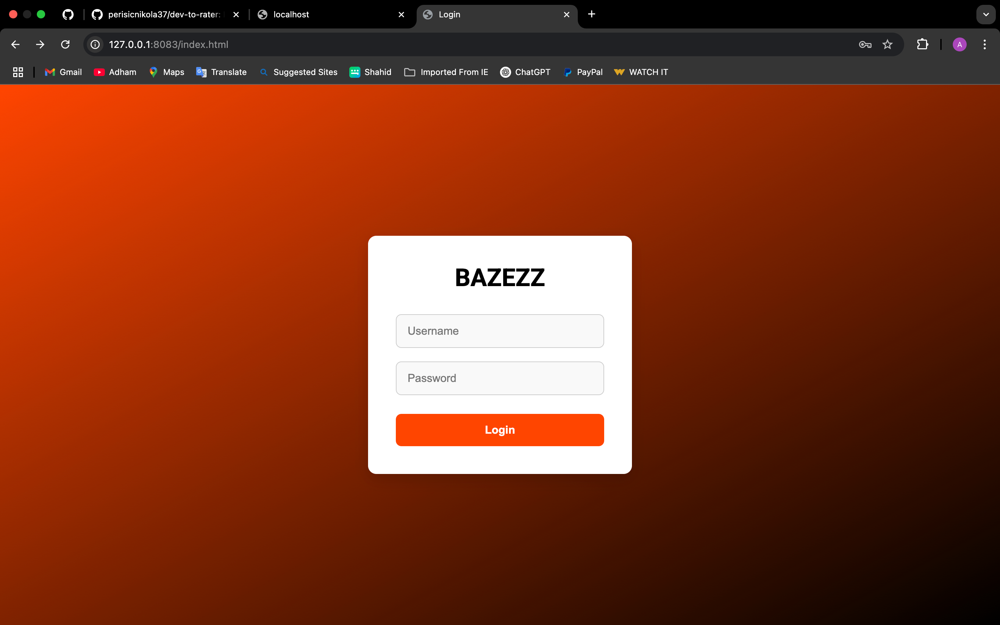
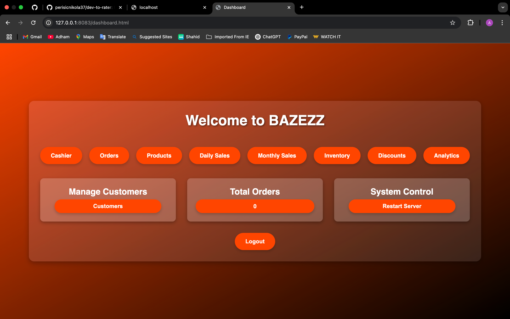
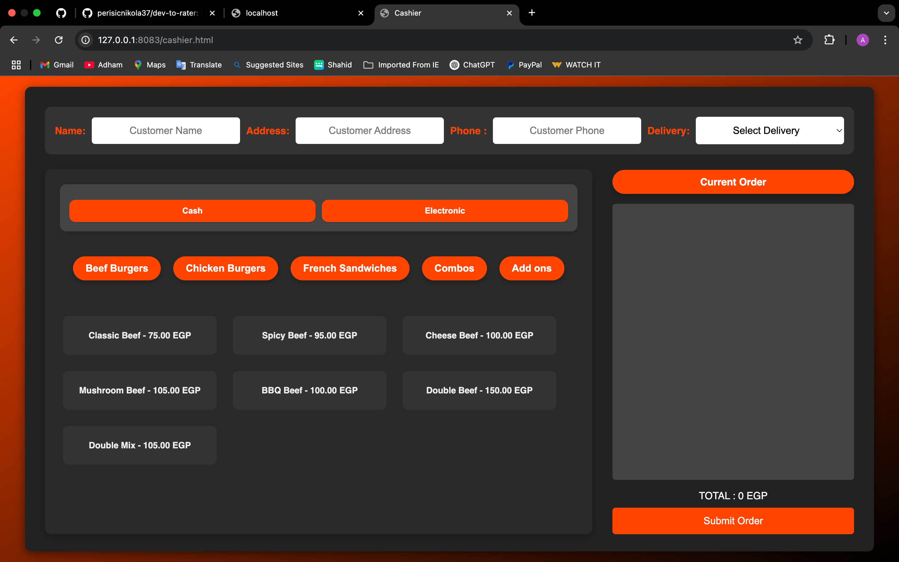

# 🍽️ Advanced Restaurant Management System

A full-featured restaurant management system that includes:
- Order management (Takeaway / Delivery)
- Customer management
- Daily & monthly reports
- Sales analytics with charts
- Role-based access (Manager / Cashier)
- Discount codes & expiry alerts
- Inventory management With Alerts
- Receipt printing with USB thermal printer

---

## 📦 Tech Stack

- Node.js (Express)
- MySQL (Sequelize ORM)
- JWT Authentication
- HTML, CSS, JavaScript (for testing UI)
- Chart.js (for analytics charts)
- Multer (file uploads)
- dotenv, CORS

---

## 📬 API Documentation

You can explore and test the full API using Postman:

🔗 [Click here to open the Postman Docs](https://www.postman.com/adhamnemr/workspace/my-workspace/documentation/40823925-ad580d36-633f-4ce2-a451-06a7d8f8d401)

> Note: The project supports USB thermal printer integration on Windows.

---

## ⚙️ Features

- Secure login with JWT & role-based redirection
- Add / Edit / Delete customers and orders
- Daily closing & monthly closing with reset analytics
- Sales analytics: top products, total revenue, delivery earnings
- Discount code management with product linking & expiration
- Alerts for low stock & product expiry dates
- Dynamic dashboard with blurred popups & filterable data
- USB Thermal Printer integration for receipt printing

---

## 🚀 Getting Started

### 1. Clone the repository

```bash
git clone https://github.com/adham4/pos_system.git
cd pos-system/server
```

### 2. Install dependencies

```bash
npm install
```

### 3. Create a `.env` file

```env
DB_HOST=localhost
DB_USER=root
DB_PASSWORD=*********
DB_NAME=pos_system
JWT_SECRET=mySuperSecretKey123
```

### 4. Run the server

```bash
node server.js
```

---

## 🖼️ Screenshots

### 🔐 Login


### 📊 Dashboard


### 💸 Cashier Page


### 📦 Order Management


### 🍔 Product Management


### 📈 Daily Sales


### 📆 Monthly Sales


### 📋 Inventory Management


### 🏷️ Discount Management


### 📊 Analytics Dashboard


### 👤 Manage Customers


### 📉 Total Order Chart


### 💰 Revenue Chart


### 🥇 Best Seller Chart


### 🥄 Least Seller Chart


### 🧑‍🤝‍🧑 Best Customers Chart


### 📦 Inventory Chart

