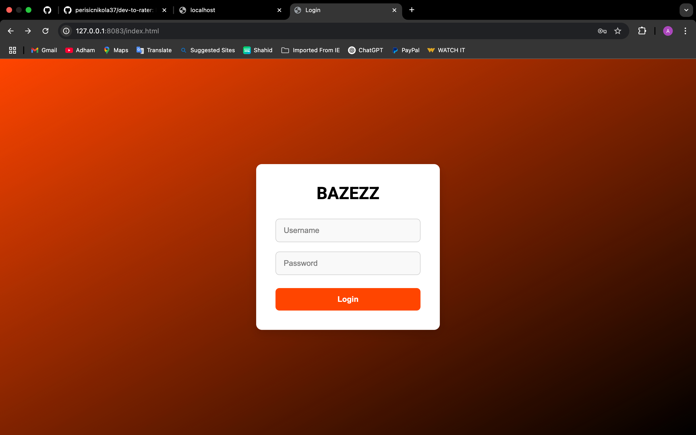
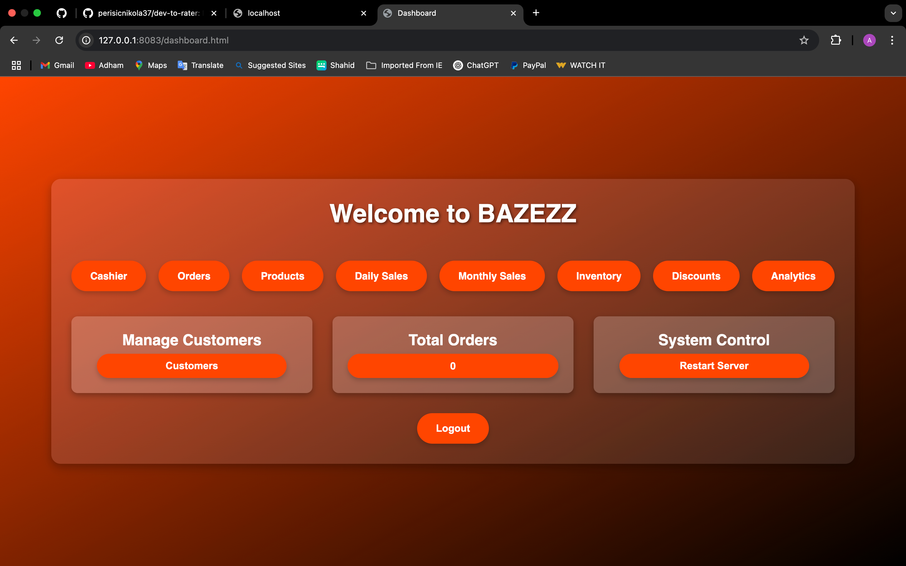
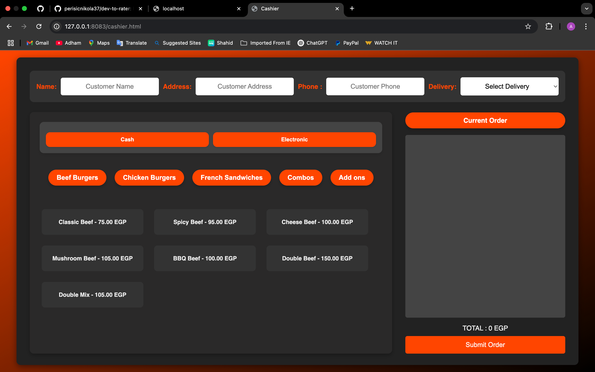

# 🌌 Vortex POS — Wholesale Ledger Edition


Vortex POS is a production-ready Wholesale and Retail Management System built for high-concurrency environments. It features atomic inventory management, professional financial tracking for merchants, and a robust security layer.

---

## 📦 Tech Stack

- **Backend:** Node.js (Express)
- **Database:** PostgreSQL (Production) / SQLite (Development) via Sequelize ORM
- **Security:** JWT Authentication with Token Revocation (Blacklisting)
- **Concurrency:** Atomic Row-Level Locking for inventory and financial consistency
- **Frontend:** HTML5, Vanilla CSS, JavaScript (Dynamic UI with Glassmorphism)
- **Analytics:** Chart.js for deep sales and financial insights
- **Storage:** Multer for asset management

---

## ⚙️ Core Features

- **🛡️ Enterprise Security:** 
  - **Fine-grained RBAC:** 5 distinct roles (Manager, Supervisor, Accountant, Cashier, Owner).
  - **Audit Logs:** Full history of all financial transactions and order cancellations (with diff tracking).
  - **Rate Limiting:** Protects sensitive endpoints (Login) from brute-force attacks.
  - **JWT Blacklisting:** Secure logout and session invalidation.
- **📈 Wholesale & Retail Logic:**
  - Automated merchant balance tracking (Debt/Credit).
  - Atomic inventory decrements to prevent race conditions.
  - Daily & Monthly closing cycles with strict business date tracking.
- **🧾 Professional Printing:** USB Thermal Printer integration with Arabic font support.
- **📊 Real-time Analytics:** Revenue tracking, best-seller charts, and inventory expiry alerts.

---

---

## 🚀 Getting Started

### 1. Clone the repository

```bash
git clone https://github.com/adhamNemr/Bazzez_Project.git
cd Bazzez_Project/pos-system/server
```

### 2. Install dependencies

```bash
npm install
```

### 3. Create a `.env` file

```env
DB_HOST=localhost
DB_USER=root
DB_PASSWORD=your_password_here
DB_NAME=pos_system
JWT_SECRET=your_super_secret_key
```

### 4. Run the server

```bash
node server.js
```

---

## 🖼️ Screenshots

### 🔐 Login


### 📊 Dashboard


### 💸 Cashier Page


### 📦 Order Management


### 🍔 Product Management


### 📈 Daily Sales


### 📆 Monthly Sales


### 📋 Inventory Management


### 🏷️ Discount Management


### 📊 Analytics Dashboard


### 👤 Manage Customers


### 📉 Total Order Chart


### 💰 Revenue Chart


### 🥇 Best Seller Chart


### 🥄 Least Seller Chart


### 🧑‍🤝‍🧑 Best Customers Chart


### 📦 Inventory Chart

